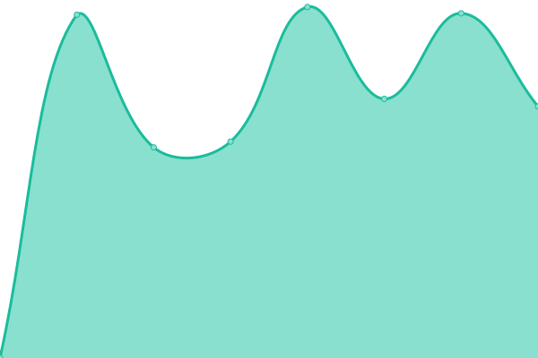

# [📈 Live Status](https://sochara-org.github.io/status/): <!--live status--> **🟧 Partial outage**

Status page for Sochara managed sites via Upptime.

With [Upptime](https://upptime.js.org), you can get your own unlimited and free uptime monitor and status page, powered entirely by a GitHub repository. We use [Issues](https://github.com/sochara-org/status/issues) as incident reports, [Actions](https://github.com/sochara-org/status/actions) as uptime monitors, and [Pages](https://sochara-org.github.io/status/) for the status page.

<!--start: status pages-->
<!-- This summary is generated by Upptime (https://github.com/upptime/upptime) -->
<!-- Do not edit this manually, your changes will be overwritten -->
<!-- prettier-ignore -->
| URL | Status | History | Response Time | Uptime |
| --- | ------ | ------- | ------------- | ------ |
|  [Homepage](https://sochara.org) | 🟩 Up | [homepage.yml](https://github.com/sochara-org/status/commits/HEAD/history/homepage.yml) | 

 1372ms
     
 | 

<a href="https://sochara-org.github.io/status/history/homepage">95.30%</a>
    

|  [CLIC](https://clic.sochara.org) | 🟥 Down | [clic.yml](https://github.com/sochara-org/status/commits/HEAD/history/clic.yml) | 

 471ms
     
 | 

<a href="https://sochara-org.github.io/status/history/clic">0.00%</a>
    

|  [Archives](https://archives.sochara.org) | 🟩 Up | [archives.yml](https://github.com/sochara-org/status/commits/HEAD/history/archives.yml) | 

 975ms
     
 | 

<a href="https://sochara-org.github.io/status/history/archives">95.31%</a>
    

|  [Wiki](https://wiki.sochara.org) | 🟩 Up | [wiki.yml](https://github.com/sochara-org/status/commits/HEAD/history/wiki.yml) | 

 491ms
     
 | 

<a href="https://sochara-org.github.io/status/history/wiki">98.01%</a>
    

|  [LMS](https://lms.sophea-sochara.org) | 🟩 Up | [lms.yml](https://github.com/sochara-org/status/commits/HEAD/history/lms.yml) | 

 721ms
     
 | 

<a href="https://sochara-org.github.io/status/history/lms">100.00%</a>
    

|  [Library](https://library.sochara.org) | 🟩 Up | [library.yml](https://github.com/sochara-org/status/commits/HEAD/history/library.yml) | 

 457ms
     
 | 

<a href="https://sochara-org.github.io/status/history/library">100.00%</a>
    

<!--end: status pages-->

[**Visit our status website →**](https://sochara-org.github.io/status/)

## 📄 License

- Powered by: [Upptime](https://github.com/upptime/upptime)
- Code: [MIT](./LICENSE)
- Data in the `./history` directory: [Open Database License](https://opendatacommons.org/licenses/odbl/1-0/)
